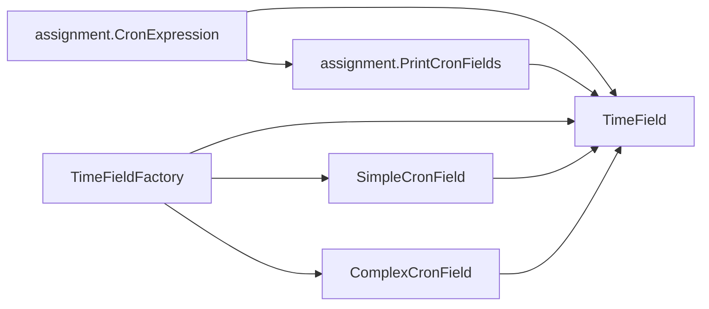

# Cron Field Parser
This project implements a simple parser for cron expressions, allowing users to parse and print various fields of a cron expression.

## Overview:

The assignment.CronFieldParser package provides classes and interfaces for parsing and printing cron expressions. The
main components of the package include:

- **CronFieldType:** An enum representing different types of cron fields such as minutes, hours, day of month, month,
  and day of week.
- **TimeField:** An interface defining a common method to retrieve field values for different cron fields.
- **SimpleCronField:** A class implementing the TimeField interface for parsing simple cron field expressions.
- **ComplexCronField:** A class extending SimpleCronField for parsing more complex cron field expressions.
- **TimeFieldFactory:** A factory class to create instances of TimeField based on the specified cron field type.
- **assignment.CronExpression:** A class representing a full cron expression and providing methods to parse and print
  its fields.
- **assignment.PrintCronFields:** A utility class to print the fields of a cron expression.

## Usage

To use the parser, follow these steps:

- Import the assignment.CronFieldParser package into your project.
- Construct an assignment.CronExpression object by passing a cron expression string to its constructor.

Here's an example of using the parser to print the fields of a cron expression:

```java
import assignment.CronFieldParser.CronExpression;
import assignment.CronExpression;

public class Main {
    public static void main(String[] args) {
        String cronString = "*/15 0 1,15 * 1-5 /usr/bin/find";
        CronExpression cronExpression = new CronExpression(cronString);
        cronExpression.print();
    }
}
```

This will print the individual fields of the cron expression along with their values.

## Class Interactions




## Using the script
The script expects only one string argument that will contain the cron line required for parsing.

```bash
./cron_parser.sh <string_argument>
```

### Examples
```bash
./cron_parser.sh "*/15 0 1,15 * 1-5 /usr/bin/find"
```
```
minute         0 15 30 45
hour           0
day of month   1 15
month          1 2 3 4 5 6 7 8 9 10 11 12
day of week    1 2 3 4 5
command        /usr/bin/find
```
```bash
./cron_parser.sh "*/10,2-5,10 9/4 1,15 * 1-5 /usr/bin/find"
```
```minute         0 2 3 4 5 10 20 30 40 50
hour           9 13 17 21
day of month   1 15
month          1 2 3 4 5 6 7 8 9 10 11 12
day of week    1 2 3 4 5
command        /usr/bin/find
```

## Scope

This program is designed to parse both complex and simple strings. For example, it can handle complex strings like "0-5,1/2" as well as simpler ones like "1-2" or "0/4" or "1".

#### Ranges : [Min, Max]
- Minutes: [0, 59]
- Hour: [0, 23]
- Day Of Month: [1,31]
- Month: [1,12]
- Day of Week: [1,7]

## Contributors:
Shubham Rawat

rawat.shubham@hotmail.com

## References
- [https://crontab.guru/](https://crontab.guru/)
- https://stackoverflow.com/questions/46696451/using-junit-5-with-java-9-without-maven-or-gradle
- [https://www.jetbrains.com/help/idea/markdown.html](https://www.jetbrains.com/help/idea/markdown.html)
